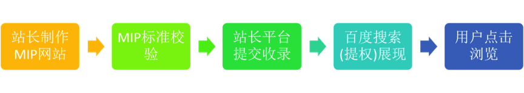
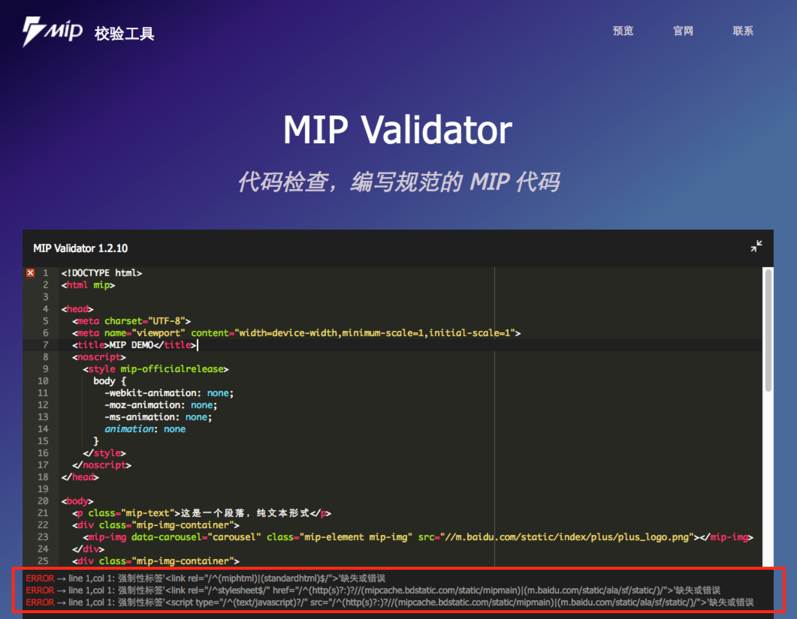
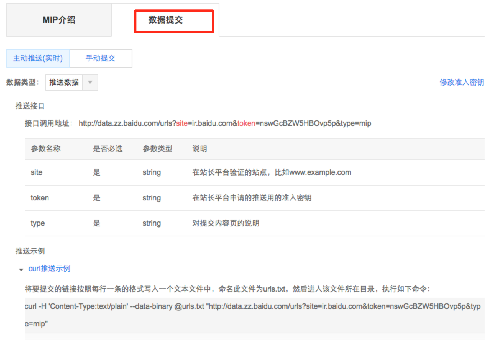

# 校验提交MIP页流程

Mip页面提交收录，并在百度搜索生效的流程如下图

 
### 1. 制作MIP网站
站长根据MIP官网上的开发指南 https://www.mipengine.org/doc/2-guide/1-mip-101.html 制作mip网站，也可以在原有的网站基础上，修改全部或者部分页面的HTML源码，使其遵循mip标准。
 
### 2. MIP标准校验
只有被百度识别为符合MIP标准的页面，才能在搜索中实现网页加速，给用户带来更友好的体验，并且在百度搜索排序中获得更好的展现机会。  
在开发完MIP网站/网页之后，或者对MIP网页进行修改之后，可借助MIP校验工具来检查页面是否遵循mip标准。只有确保网页符合MIP标准，才能避免失去在相关的搜索展现上的优势。  
MIP校验工具网址：https://www.mipengine.org/validator/validate ，校验流程如下图所示：
 
粘贴页面源代码到页面中，校验工具会实时产生校验结果
- 如果通过校验，表示页面符合MIP标准。可以通过站长平台“数据提交”页面给百度收录。  
- 如果没有通过校验，表示页面不符合MIP标准。请根据下方提示的错误说明和修复方法，修改页面，并重新提交校验。  
校验错误说明样例如下图：

 
### 3. 站长平台提交收录
MIP页面通过检验之后，为了尽快让百度搜索引擎发现它们，并在检索生效，可以在站长平台提交MIP页面的url list.   
另外，如果修改了MIP页面，为了尽快在百度索引中更新网页内容，也可以重新提交mip页面。  
MIP页面提交入口：http://zhanzhang.baidu.com/mip/index 

 
提交分为“主动推送（实时）“ 和 “手动提交” 两种模式，前者为API接口形式，适用于大规模数据的提交，后者是手动形式，适用于小数据验证。具体的提交方法，请阅读提交入口下面的说明。 

### 4. 百度搜索展现
符合MIP标准的页面能够给用户带来更快的加载速度和更好的交互体验。在百度移动搜索上，百度会对符合MIP标准的结果进行一定的加权，帮助MIP网站获得更多的流量。    
Mip结果在百度的展现有2种具体的形式：  

- Mip原始检索： mip html页面被提交收录之后，能够独立参与排序，并获得展现机会。
- Mip适配：mip页面能够继承对应的standard html的排序权重，获得展现机会。 （百度会自动将在mip html中标注好的standard html与mip html建立适配映射关系，在百度移动搜索上当standard html 作为搜索结果被点击，百度会推送其对应的mip html给用户展现）  

不管哪种形式，mip页面在百度移动搜索中都能获得排序加权。    
参考链接：  
standard html标注：https://www.mipengine.org/doc/2-guide/show-your-page.html    
移动适配机制：http://zhanzhang.baidu.com/college/courseinfo?id=267&page=20#h2_article_title4

### 5. 用户点击浏览
MIP页面在百度移动搜索上被用户点击后，百度会调用极速浏览框架加载mip页面，并通过cache机制对mip页面进行加速。如下图所示，上面蓝色的导航条即为极速浏览框架框架，下面为被嵌入的MIP页面：

