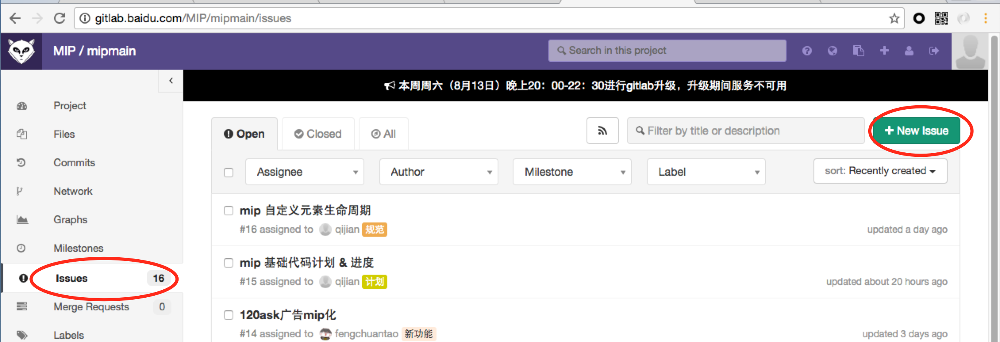
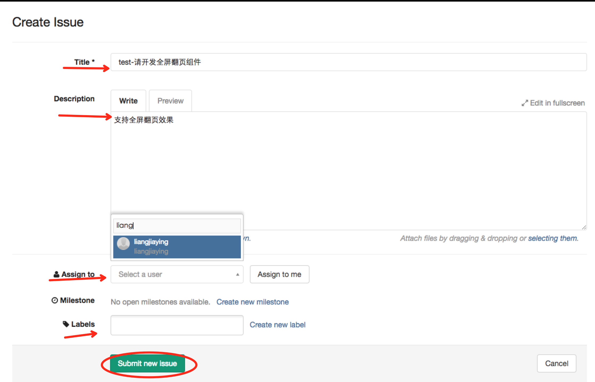
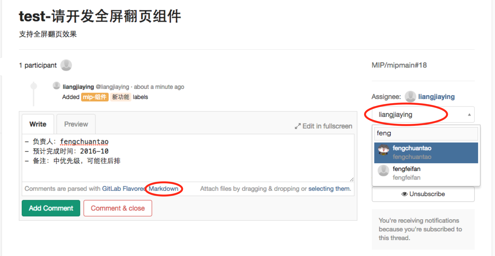
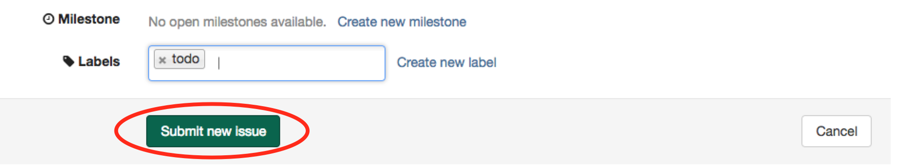
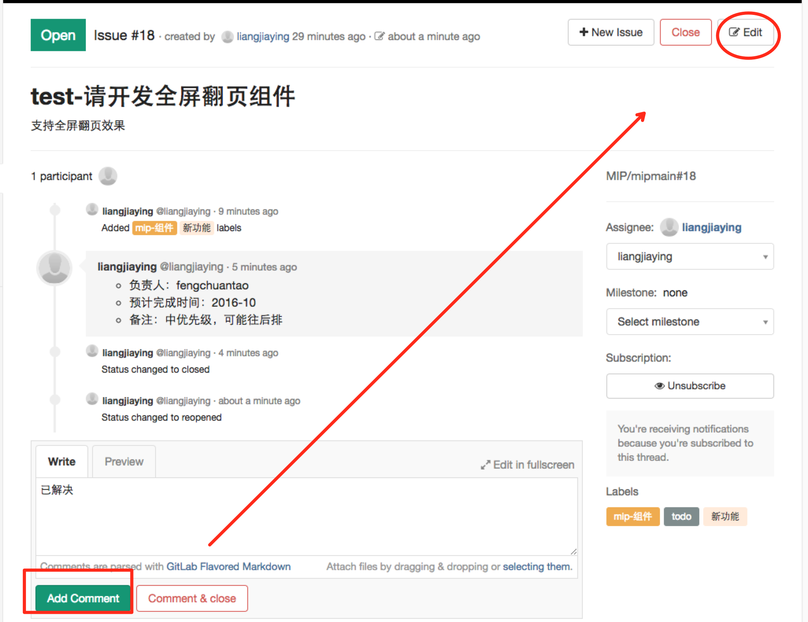

# MIP 项目提 issue 流程指导
本文档面向FE，UE，PM以及所有关注MIP的百度人

### 提问题 - 添加issue
发现问题后，要对问题进行责任归类，统一的[mipmain项目](http://gitlab.baidu.com/MIP/mipmain)下提issue，并指定给负责人。

|项目|FE负责人|
|--|--|
|MIP 框架实现|shenzhou|
|MIP 组件|lilangbo|
|MIP 官网|liangjiaying|

具体操作如下：
1. 在页面中点击添加issue

2. 填写issue内容，指给负责人

3. 给这个问题用label归类

4. 点击提交即可

### 跟进问题

针对__BUG__及 __需求__, 负责人跟进回复，并assign给同学开发。  
回复写明负责人，预计完成时间（可用markdown格式）

开发同学收到issue后，添加 __进行中…__ Label
### 解决问题
负责同学解决后，在issue中回复，并添加 __已解决__ Label

